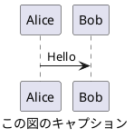

# CLAUDE.md

このファイルは、Claude Code (claude.ai/code) がこのリポジトリのコードを操作する際のガイダンスを提供します。

<important_rules>
性能改善やリファクタリングを要求された際は、オリジナルのソース解説コメントを維持してください。

**編集に関するルール**

編集を行う際は、編集の目的が精度向上であることを念頭において作業してください。
目的があいまいな場合は、以下のどの編集行為を行うとしているのか、ユーザーに問い合わせてください。

以下が一般的な編集です。

+ Polish: 仕上げの微調整、表現をなめらかにする
+ Refine: 不要部分を削り、精度を高める
+ Edit: 全般的な編集、誤字修正から大幅改変まで幅広い
+ Revise: 内容や構成を再検討して修正

以下の編集は、明確な書き直しや書き換えの指示がない限り、実施しないでください。

+ Rewrite: 大きく書き直す（意味も変わることあり）
+ Rephrase: 同じ意味を別の言い回しで表す
+ Reword: 特定の単語や表現を置き換える
+ Paraphrase: 意味を保ったまま言い換える

**単語の強制**

以下に示す単語は、同義語、同じ意味の他言語の単語に優先して使用すること。

+ Markdown

**表記に関するルール**

このルールは、**ソースコード内のコメントでも有効** です。

+ 本文の文末を `：` で終わらせないでください。きちんと文章として完結させてください。
+ 全角括弧 `（` `）` や全角コロン `：` は使用せず、半角で記述してください。
+ 日本語と英単語の間は、半角スペースを挿入してください。
+ 見出し (#, ##, ...) と本文の間、および、本文とコードブロックの間は、空行を挿入してください。
+ 見出し (#, ##, ...) と見出し (#, ##, ...) の間に水平線 (`----`) を挿入しないでください。
+ 見出し (#, ##, ...) に続く文字列に番号 (1. など) を付与しないでください。
+ 絵文字の使用は最低限度の使用にしてください。シンプルな意味論を持つ絵文字として ✅, ❌, 🟢, 🟡, 🔴 などは許容します。
+ 特に言語の指定のないコードブロックの場合でも、'```text' のように形式を明示してください。

**図に関するルール**

ユーザーに図を提示する際は、原則として、PlantUML 形式としてください。  
plantuml コードブロックへのファイル名付与は不要です。  
PlantUML による記法では、`@startuml` と `caption` に同じタイトル文字列を付与してください。 `title` は使用しないでください。以下に例を示します。



PlantUML にてフローを説明する際は、アクティビティ図を優先してください。  
シーケンスに着目すべき内容の説明、および、シーケンス図を要求された場合は、シーケンス図としてください。  
適切であると判断された場合は、他の PlantUML 形式も活用してください。

PlantUML 形式での表現が困難な場合は、marmaid 形式としてください。  
marmaid による記法では、コードブロックの caption にタイトル文字列を付与してください。以下に例を示します。

```{.mermaid caption="Mermaid の図キャプション"}
sequenceDiagram
    Alice->>John: Hello John, how are you?
```

指示があった場合は、draw.io にインポート可能な xml の提示をしてください。  
</important_rules>

## 概要

このプロジェクトは、Oracle Linux 8 ベースのポータブルな開発用コンテナを Podman で構築・管理するためのシステムです。コンテナには開発ツール (Node.js、Java、.NET、Python)、ドキュメント生成ツール (Doxygen、PlantUML、Pandoc)、日本語マニュアルページが含まれます。

## アーキテクチャ

- **ベースイメージ**: Oracle Linux 8
- **コンテナエンジン**: Podman (rootless mode)
- **主要ディレクトリ**:
  - `src/`: コンテナイメージのビルドファイル群
  - `storage/`: ホストとコンテナ間の永続化データ
  - `image/`: イメージの tar ファイル保存場所

### コンテナビルド仕様

Dockerfile はポータブルイメージとして以下をセットアップします。

1. Oracle Linux 8 パッケージの更新と開発ツールの導入
2. 開発環境 (Node.js 22、Java 17、.NET 9.0、Python 3.11)
3. ドキュメント生成ツール (Doxygen、PlantUML、Pandoc 系)
4. 日本語環境とフォント設定
5. SSH サーバーと認証キー設定
6. 日本語マニュアルページの自動インストール
7. sudo 設定 (wheel グループ)

**注意**: ユーザー作成はビルド時ではなく、コンテナ起動時に entrypoint.sh で動的に行います。

### ユーザー管理と UID/GID マッピング

- **ポータブル設計**: ビルド時にユーザーを作成せず、起動時に動的作成
- **環境変数**: HOST_USER、HOST_UID、HOST_GID でユーザー情報を指定
- **keep-id オプション**: Podman の UID/GID マッピングでファイル権限を保持
- **root 権限**: entrypoint.sh は root で実行され、ユーザー作成や設定を実行

## 共通コマンド

### コンテナ管理

```bash
# イメージビルド
./build-pod.sh

# コンテナ起動
./start-pod.sh

# コンテナ停止
./stop-pod.sh

# イメージ保存 (圧縮 tar として)
./save-pod.sh

# イメージ読み込み
./load-pod.sh
```

### 接続方法

```bash
# SSH 接続 (ポート 40022)
ssh -p 40022 user@127.0.0.1

# SSH 鍵キャッシュのクリア (新規ビルド後)
ssh-keygen -R "[127.0.0.1]:40022"
```

## 重要な設定

### SSH 認証

- `~/.ssh/id_rsa.pub` が存在する場合、自動的に `authorized_keys` に設定
- 公開鍵認証が有効な場合、パスワード認証は自動的に無効化
- SSH ホストキーは `src/keys/` に保存して再利用可能
- sshd は root 権限で起動し、作成されたユーザーでログイン

### マウント設定

- `./storage/1/home_${USER}` → `/home/${USER}` (ホームディレクトリ)
- `./storage/1/workspace` → `/workspace` (作業ディレクトリ)

### 環境変数

- `LANG=ja_JP.UTF-8` (日本語ロケール)
- Node.js パッケージはユーザーローカル (`~/.node_modules`)

## 開発環境詳細

### インストール済みツール

- **言語ランタイム**: Node.js 22、Java 17、.NET 9.0、Python 3.11
- **ビルドツール**: GCC、Make、automake、libtool
- **ドキュメント**: Doxygen、doxybook2、PlantUML、Pandoc
- **テスト**: GoogleTest (システムワイド)
- **ユーティリティ**: jq、tree、rsync、expect

### パッケージ管理

- **Node.js**: npm (ユーザーローカルプレフィックス設定済み)
- **Python**: pip (システムとユーザー両方利用可能)
- **Java**: OpenJDK 17 がデフォルト
- **.NET**: SDK 9.0

### カスタムインストール処理

- 日本語マニュアルページ: `man-pages-ja-auto-installer.sh` で自動インストール
- フォント: `src/fonts/` からシステムフォントとして自動配置
- 追加パッケージ: `src/packages/` から各種ツールを個別インストール

## ファイル配置規則

- `src/keys/`: SSH ホストキー (オプション)
- `src/fonts/`: 追加フォントファイル (オプション)
- `src/packages/`: 追加パッケージの事前ダウンロード (オプション)
- `src/container-release`: ビルド時刻の記録 (自動生成)

## 注意事項

- rootless Podman を使用するため、システムレベルの特権操作は制限される
- コンテナ内で sudo は利用可能 (wheel グループ、NOPASSWD 設定)
- UID/GID マッピングにより、ホストとコンテナ間でファイル所有権が保持される
- イメージはポータブルで、異なる環境での使い回しが可能
- entrypoint.sh は root で実行され、動的にユーザー作成や環境設定を実行
