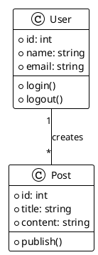

# ドキュメント生成のサンプル

このドキュメントでは、Doxygen、PlantUML、Pandoc を使用してドキュメントを自動生成する GitHub Actions ワークフローの例を示します。

## 完全なワークフロー例

```yaml
name: Generate Documentation

on:
  push:
    branches: [ main ]
  pull_request:
    branches: [ main ]

jobs:
  generate-docs:
    runs-on: ubuntu-latest

    container:
      image: ghcr.io/<user>/<repo>/oracle-linux-8-dev:latest
      credentials:
        username: ${{ github.actor }}
        password: ${{ secrets.GITHUB_TOKEN }}
      env:
        HOST_USER: docgen
        HOST_UID: 1000
        HOST_GID: 1000
        LANG: ja_JP.UTF-8

    steps:
      - name: Checkout repository
        uses: actions/checkout@v4

      - name: Display tool versions
        run: |
          doxygen --version
          plantuml -version
          pandoc --version

      - name: Generate PlantUML diagrams
        run: |
          find ./docs -name "*.puml" -exec plantuml {} \;

      - name: Generate Doxygen documentation
        run: doxygen Doxyfile

      - name: Convert Doxygen XML to Markdown
        run: |
          doxybook2 --input ./docs/xml \
                    --output ./docs/markdown \
                    --config .doxybook/config.json

      - name: Build PDF documentation
        run: |
          cd docs/markdown
          pandoc *.md \
            --filter pandoc-crossref \
            --pdf-engine=xelatex \
            --toc \
            --number-sections \
            -o ../documentation.pdf \
            -V documentclass=ltjsarticle \
            -V lang=ja \
            -V geometry:margin=2.5cm

      - name: Upload HTML documentation
        uses: actions/upload-artifact@v3
        with:
          name: html-docs
          path: docs/html/

      - name: Upload Markdown documentation
        uses: actions/upload-artifact@v3
        with:
          name: markdown-docs
          path: docs/markdown/

      - name: Upload PDF documentation
        uses: actions/upload-artifact@v3
        with:
          name: pdf-docs
          path: docs/documentation.pdf

      - name: Deploy to GitHub Pages
        if: github.event_name == 'push' && github.ref == 'refs/heads/main'
        uses: peaceiris/actions-gh-pages@v3
        with:
          github_token: ${{ secrets.GITHUB_TOKEN }}
          publish_dir: ./docs/html
```

## Doxygen の設定

### Doxyfile の基本設定

```doxyfile
PROJECT_NAME           = "My Project"
PROJECT_NUMBER         = 1.0.0
PROJECT_BRIEF          = "Brief description of the project"

OUTPUT_DIRECTORY       = docs
GENERATE_HTML          = YES
GENERATE_XML           = YES
GENERATE_LATEX         = NO

INPUT                  = src/ include/
RECURSIVE              = YES
FILE_PATTERNS          = *.c *.cpp *.h *.hpp

EXTRACT_ALL            = YES
EXTRACT_PRIVATE        = NO
EXTRACT_STATIC         = YES

HTML_OUTPUT            = html
XML_OUTPUT             = xml

GENERATE_TREEVIEW      = YES
HAVE_DOT               = NO
```

### ワークフローでの Doxygen 実行

```yaml
- name: Generate Doxygen documentation
  run: doxygen Doxyfile
```

カスタム設定ファイルを使用：

```yaml
- name: Generate Doxygen documentation
  run: doxygen custom.doxyfile
```

### Doxygen 警告をエラーとして扱う

```yaml
- name: Generate Doxygen documentation
  run: |
    doxygen Doxyfile 2>&1 | tee doxygen.log
    if grep -q "warning:" doxygen.log; then
      echo "Doxygen warnings found"
      exit 1
    fi
```

## doxybook2 による Markdown 変換

### 設定ファイル (.doxybook/config.json)

```json
{
  "baseUrl": "/",
  "indexInFolders": false,
  "linkSuffix": "/",
  "mainPageInRoot": true,
  "replaceUnderscoresInAnchors": true,
  "sort": true
}
```

### ワークフローでの実行

```yaml
- name: Convert to Markdown with doxybook2
  run: |
    doxybook2 --input ./docs/xml \
              --output ./docs/markdown \
              --config .doxybook/config.json
```

## PlantUML 図の生成

### PlantUML ファイルの例 (diagram.puml)



### ワークフローでの PlantUML 実行

```yaml
- name: Generate PlantUML diagrams
  run: |
    # すべての .puml ファイルを処理
    find ./docs -name "*.puml" -exec plantuml {} \;

    # PNG 形式で出力
    find ./docs -name "*.puml" -exec plantuml -tpng {} \;

    # SVG 形式で出力
    find ./docs -name "*.puml" -exec plantuml -tsvg {} \;
```

特定のディレクトリのみ処理：

```yaml
- name: Generate diagrams in specific directory
  run: plantuml -o ../images docs/diagrams/*.puml
```

## Pandoc によるドキュメント変換

### Markdown から PDF への変換

```yaml
- name: Convert Markdown to PDF
  run: |
    pandoc README.md \
      --pdf-engine=xelatex \
      -o documentation.pdf \
      -V documentclass=ltjsarticle \
      -V lang=ja \
      -V geometry:margin=2.5cm
```

### 日本語ドキュメントの生成

```yaml
- name: Generate Japanese PDF
  run: |
    pandoc docs/*.md \
      --filter pandoc-crossref \
      --pdf-engine=xelatex \
      --toc \
      --toc-depth=3 \
      --number-sections \
      -o output.pdf \
      -V documentclass=ltjsarticle \
      -V lang=ja \
      -V geometry:margin=2.5cm \
      -V mainfont="UDEVGothicHSRFJPDOC-Regular" \
      --metadata title="ドキュメント" \
      --metadata author="Author Name"
```

### 複数形式への変換

```yaml
- name: Convert to multiple formats
  run: |
    # PDF
    pandoc docs/guide.md -o guide.pdf --pdf-engine=xelatex -V documentclass=ltjsarticle

    # HTML
    pandoc docs/guide.md -o guide.html --standalone --toc

    # DOCX
    pandoc docs/guide.md -o guide.docx

    # EPUB
    pandoc docs/guide.md -o guide.epub
```

## GitHub Pages へのデプロイ

### 基本的なデプロイ

```yaml
- name: Deploy to GitHub Pages
  if: github.event_name == 'push' && github.ref == 'refs/heads/main'
  uses: peaceiris/actions-gh-pages@v3
  with:
    github_token: ${{ secrets.GITHUB_TOKEN }}
    publish_dir: ./docs/html
```

### カスタムドメインの設定

```yaml
- name: Deploy to GitHub Pages with custom domain
  uses: peaceiris/actions-gh-pages@v3
  with:
    github_token: ${{ secrets.GITHUB_TOKEN }}
    publish_dir: ./docs/html
    cname: docs.example.com
```

### デプロイ前の処理

```yaml
- name: Prepare for deployment
  run: |
    cp -r docs/html/* ./deploy/
    cp CNAME ./deploy/
    echo "User-agent: *" > ./deploy/robots.txt
    echo "Allow: /" >> ./deploy/robots.txt

- name: Deploy to GitHub Pages
  uses: peaceiris/actions-gh-pages@v3
  with:
    github_token: ${{ secrets.GITHUB_TOKEN }}
    publish_dir: ./deploy
```

## MkDocs を使用する場合

```yaml
steps:
  - uses: actions/checkout@v4

  - name: Install MkDocs
    run: |
      python -m venv venv
      source venv/bin/activate
      pip install mkdocs mkdocs-material

  - name: Build documentation
    run: |
      source venv/bin/activate
      mkdocs build

  - name: Deploy to GitHub Pages
    uses: peaceiris/actions-gh-pages@v3
    with:
      github_token: ${{ secrets.GITHUB_TOKEN }}
      publish_dir: ./site
```

## Sphinx を使用する場合 (Python)

```yaml
steps:
  - uses: actions/checkout@v4

  - name: Install Sphinx
    run: |
      python -m venv venv
      source venv/bin/activate
      pip install sphinx sphinx-rtd-theme

  - name: Build Sphinx documentation
    run: |
      source venv/bin/activate
      cd docs
      make html

  - name: Upload documentation
    uses: actions/upload-artifact@v3
    with:
      name: sphinx-docs
      path: docs/_build/html/
```

## ドキュメントバージョニング

バージョンごとにドキュメントを保存する例：

```yaml
- name: Generate versioned documentation
  run: |
    VERSION=$(git describe --tags --abbrev=0)
    doxygen Doxyfile
    mkdir -p docs/versions/$VERSION
    cp -r docs/html/* docs/versions/$VERSION/

- name: Deploy all versions
  uses: peaceiris/actions-gh-pages@v3
  with:
    github_token: ${{ secrets.GITHUB_TOKEN }}
    publish_dir: ./docs/versions
    keep_files: true  # 既存のバージョンを保持
```

## ドキュメントリンクチェック

```yaml
- name: Check links in documentation
  run: |
    sudo dnf install -y npm
    npm install -g markdown-link-check
    find docs -name "*.md" -exec markdown-link-check {} \;
```

## API ドキュメントの生成

### TypeScript/JavaScript (TypeDoc)

```yaml
- name: Generate TypeDoc documentation
  run: |
    npm install -g typedoc
    typedoc --out docs/api src/
```

### Python (pdoc)

```yaml
- name: Generate Python API documentation
  run: |
    source venv/bin/activate
    pip install pdoc3
    pdoc --html --output-dir docs/api src/
```

## 関連ドキュメント

- [基本的な使い方](./basics.md) - コンテナの基本的な使用方法
- [C/C++ プロジェクト](./cpp-example.md) - Doxygen の実践例
- [高度な設定](./advanced-configuration.md) - 詳細な設定方法
- [ベストプラクティス](./best-practices.md) - ドキュメント生成の推奨事項
